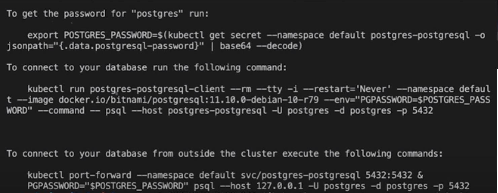

## Gerando image do docker

```
docker build -t herculesr/codepix:latest -f codepix/Dockerfile.prod codepix

docker build -t herculesr/bankapi:latest -f bank-api/Dockerfile.prod bank-api

docker build -t herculesr/bankfrontend:latest -f bank-frontend/Dockerfile.prod bank-frontend
```

### Docker hub

```
docker push herculesr/codepix:latest

docker push herculesr/bankapi:latest

docker push herculesr/bankfrontend:latest
```

### Kubernetes

Vamos utilizar [Kind](https://kind.sigs.k8s.io/) é uma ferramenta para executar clusters Kubernetes locais usando "nós" de contêiner do Docker.

```
GO111MODULE="on" go get sigs.k8s.io/kind

kind create cluster --name=codepix
```

### kubectl

A ferramenta de linha de comando do Kubernetes o [kubectl](https://kubernetes.io/docs/tasks/tools/install-kubectl/), permite que você execute comandos em clusters do Kubernetes. Você pode implantar aplicativos, inspecionar e gerenciar recursos de cluster e visualizar registros.

```
curl -LO "https://dl.k8s.io/release/$(curl -L -s https://dl.k8s.io/release/stable.txt)/bin/linux/amd64/kubectl"

kubectl cluster-info --context kind-codepix

kubectl get nodes
```

### Aplicando deployment

```
cd .\k8s\codepix\

kubectl apply -f configmap.yaml
kubectl apply -f deploy.yaml

kubectl get pods
```

#### Vendo erros e logs

```
kubectl describe pod PODE_NAME

kubectl logs PODE_NAME
```

Não é recomendado instalar um database no kubernetes, mas vamos fazer.

### helm

[Helm](https://helm.sh/) é um gerenciador de pacotes para Kubernetes

```
curl -fsSL -o get_helm.sh https://raw.githubusercontent.com/helm/helm/master/scripts/get-helm-3

chmod 700 get_helm.sh

./get_helm.sh
```

```
helm repo add bitnami https://charts.bitnami.com/bitnami

helm install postgres bitnami/postgresql
```

Depois de instalar vai mostra como pegar sua senha e se conectar no banco



- Exporte a senha
- Ver a senha `echo $POSTGRES_PASSWORD`

Ver se postgres esta rodando:

```
kubectl get pods
```

- Conectar no banco ( _segundo comando da imagem_ )

Criando bancos de dados ( _conectado no banco_ ):

```
CREATE DATABASE codepix;

CREATE DATABASE bank001;

CREATE DATABASE bank002;
```

```
cd .\k8s\codepix\

kubectl apply -f secret.yaml
kubectl apply -f deploy.yaml
```

Caso erro apague o pod:

```
kubectl delete pod POD_NAME
```

Não é recomendado instalar o kafka no kubernetes, mas vamos fazer.

```
helm install kafka bitnami/kafka
```

```
kubectl apply -f service.yaml

kubectl get svc
```

## Bank-api

```
cd .\k8s\bankapi\

kubectl apply -f configmap.yaml
kubectl apply -f secret.yaml

kubectl get configmaps

kubectl apply -f secret.yaml
kubectl apply -f service.yaml

kubectl get svc
```

```
kubectl get po

kubectl exec -it POD_NAME bash
```

- Dentro do container:

```
npm run typeorm migration:run
npm run console fixtures
```

Apontamento da maquina real para o cluster

```
kubectl port-forward srv/bankapi-service 8080:3000
```

Abra algo para ver se esta online `http://localhost:8080/`

### Bank-api 002

```
cd .\k8s\bankapi002\

kubectl apply -f .

kubectl get po

kubectl exec -it POD_NAME bash

```

- Dentro do container:

```
npm run typeorm migration:run
npm run console fixtures
```

## Bank front end

```
cd .\k8s\bankfrontend\

kubectl apply -f .

kubectl get pods

kubectl exec -it POD_NAME bash
```

Apontamento da maquina real (**CPU**) para o cluster. extern-ip vai ficar pendente
porque a **CPU** nao consegue provisionar um ip externo, caso fosse uma **Azure**, **AWS**,
**Google Cloud**, **DigitalOcean** o ip externo ja seria disponibilizado.

```
kubectl port-forward srv/bankfrontend-service 9090:3000
```

Abra algo para ver se esta online `http://localhost:9090/`

Em Desenvolvimento nao consegue-se cadastrar uma pix key ou fazer transferência,
para funcionar somente colocando no **ar** e colocando o ip externo na `NEXT_PUBLIC_NEST_API_URL=https://EXTERN_IP:3000/api`

## Bank front end 002

```
cd .\k8s\bankfrontend002\

kubectl apply -f .

kubectl get pods
kubectl get scv

kubectl port-forward srv/bankfrontend002-service 9091:3000
```
